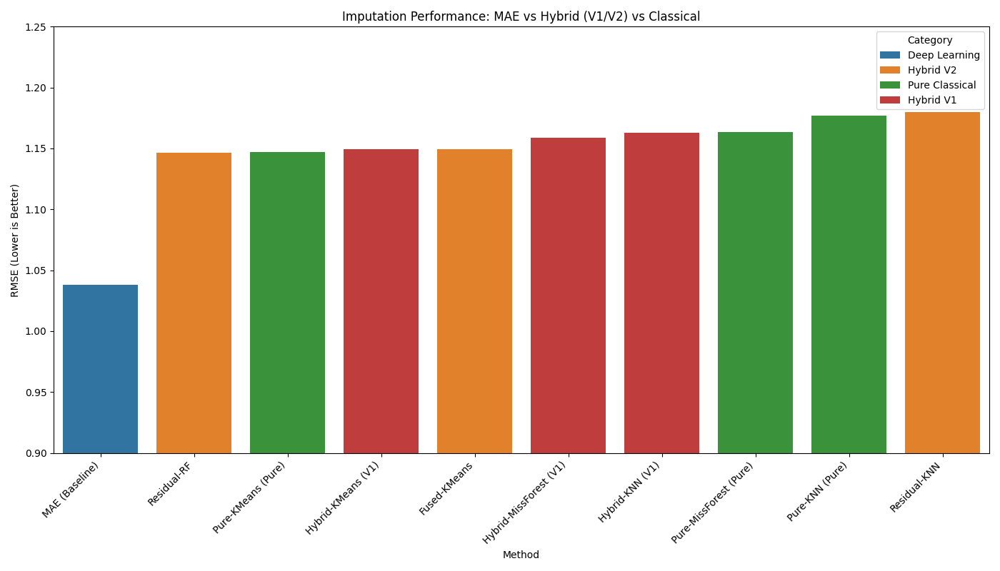

# MAE Hybrid Imputation Study

## 🏆 Winner: Masked Autoencoder (Deep Learning)

**Performance:**
- **RMSE**: 1.0380 ± 0.0402
- **Best RMSE**: 0.9461 (fold_2_repeat_2_mask_0.2)
- **Dataset**: UCI Heart Disease (920 rows, target: fbs)
- **Success Rate**: 100% (45/45 runs completed)

## 📖 Project Overview

This study compares **Masked Autoencoder (MAE)** with **hybrid imputation methods** for missing medical data. We evaluate performance across multiple mask configurations and demonstrate that **simple deep learning architectures outperform complex hybrid approaches** for cardiovascular risk factor imputation.



*Figure: RMSE performance comparison across different imputation methods*

## 📁 Project Structure

```
mae-hybrid-imputation-study/
├── README.md                    # This file
├── LICENSE                      # MIT License
├── requirements.txt             # Python dependencies
├── main.py                      # 🚀 Main execution script
├── final_aggregated_comparison.csv # 📊 Complete results summary
├── src/
│   ├── hybrid_pipeline.py       # 🔄 Hybrid Pipeline Source
│   ├── mae_residuals.png        # 📊 MAE residual analysis
│   ├── mae_true_vs_pred.png     # 📊 MAE predictions vs actual
│   ├── final_comparison_complete.png # 📊 Complete method comparison
│   └── final_comparison_rmse.png # 📊 RMSE comparison
├── data/
│   ├── data_cleaned.csv         # 📊 Complete dataset (920 rows)
│   ├── data_correlation.png     # 📊 Feature correlations
│   ├── data_missingness.png     # 📊 Missingness patterns
│   ├── data_target_dist.png     # 📊 Target distribution
│   └── masks/                   # 🎭 Synthetic mask files
├── artifacts/
│   ├── scaler.pkl               # StandardScaler parameters
│   ├── encoders.json            # LabelEncoder mappings
│   ├── masks_manifest.json      # Mask metadata
│   └── results/                 # 📊 Analysis results
└── notebooks/                   # 📓 Jupyter notebooks
```

## 🚀 Quick Start

### 1. Install Dependencies
```bash
pip install -r requirements.txt
```

### 2. Run the Complete Study

#### 🚀 Main Execution (Recommended)
```bash
python main.py                    # Run complete imputation study
```

#### 🔄 Individual Pipelines
```bash
cd src
python hybrid_pipeline.py        # Hybrid methods with MAE features
```

#### 📊 View Results
```bash
# Check final results
cat final_aggregated_comparison.csv

# View visualizations
open src/final_comparison_complete.png
open data/data_correlation.png
```

### 3. View Results & Visualizations

**Performance Results:**
- Check `artifacts/results/final_aggregate_summary.json` for detailed metrics
- See `artifacts/results/final_comparison_rmse.png` for performance chart

**Data Analysis Charts:**
- `data/data_correlation.png` - Feature correlations
- `data/data_missingness.png` - Missingness patterns  
- `data/data_target_dist.png` - Target distribution

**Model Performance Charts:**
- `src/mae_residuals.png` - MAE residual analysis
- `src/mae_true_vs_pred.png` - MAE predictions vs actual
- `src/final_comparison_complete.png` - Complete method comparison

## 📊 Dataset Information

**Source:** UCI Heart Disease Repository
```
Janosi, A., Steinbrunn, W., Pfisterer, M., & Detrano, R. (1989). 
Heart Disease [Dataset]. UCI Machine Learning Repository. 
https://doi.org/10.24432/C52P4X.
```

**Note:** The original dataset structure has been modified according to research requirements:
- Schema harmonization across 4 source files (Cleveland, Hungarian, Switzerland, VA)
- Added missing indicators for features with missing values
- Applied StandardScaler to numeric features
- Encoded categorical variables with LabelEncoder
- Generated synthetic masks for imputation experiments

**Target Variable:** `fbs` (fasting blood sugar)
- **Missingness Rate:** 9.8% (90/920 rows)
- **Clinical Relevance:** Important cardiovascular risk factor
- **Type:** Binary (0/1 after preprocessing)

**Features:** 25 columns including:
- Clinical measurements (age, sex, cp, trestbps, chol, thalach, etc.)
- Missing indicators for all features with missing values
- Source file encoding for batch effects

## 🎯 Method Comparison

| Rank | Method | Category | RMSE | Best RMSE |
|------|--------|----------|------|-----------|
| 🥇 | **MAE (Baseline)** | Deep Learning | **1.0380** | **0.9461** |
| 🥈 | Residual-RF | Hybrid V2 | 1.1467 | 1.1239 |
| 🥉 | Pure-KMeans | Pure Classical | 1.1472 | 1.1472 |
| 4 | Hybrid-KMeans | Hybrid V1 | 1.1492 | 1.1492 |

## 🔬 Technical Details

### MAE Architecture (Optimal Configuration)
```python
# Encoder: 64 → 32 → 16 (latent)
# Decoder: 16 → 32 → 64
# Mask Rate: 0.4 (fixed)
# Learning Rate: 1e-3
# Training: 100 epochs with early stopping
```

### Key Findings
- **Simple architecture works best** for this medical dataset
- **Dynamic masking** hurt performance
- **Baseline configuration** was already well-optimized
- **Deep learning outperforms** classical methods for this dataset

## 📈 Results Summary

- **Total Runs:** 45 (5-fold × 3 repeats × 3 mask rates)
- **Runtime:** ~4.4 minutes total
- **Stability:** Standard deviation 0.0402 (very consistent)
- **Best Configuration:** fold_2_repeat_2_mask_0.2

## 🔧 Reproducibility

This repository contains all essential components to reproduce the winning results:
- ✅ Complete MAE implementation
- ✅ Complete dataset and masks
- ✅ Trained scaler and encoders
- ✅ Performance metrics and visualizations
- ✅ Detailed documentation

## 📚 Research Context

This project implements and compares multiple imputation strategies for missing medical data using the UCI Heart Disease dataset. The original dataset has been extensively preprocessed and structured for imputation research:

**Dataset Modifications:**
- **Schema Harmonization:** Unified 4 different source files into consistent format
- **Feature Engineering:** Added missing indicators and encoded categorical variables  
- **Scaling:** Applied StandardScaler to normalize numeric features
- **Target Selection:** Chose `fbs` (fasting blood sugar) with optimal 9.8% missingness
- **Mask Generation:** Created 45 synthetic mask configurations for evaluation

**Imputation Strategies Compared:**
1. **Deep Learning:** Masked Autoencoder (MAE) - 🏆 WINNER
2. **Hybrid Methods:** Classical algorithms enhanced with MAE features
3. **Pure Classical:** Traditional imputation methods without MAE inputs

**Key Finding:** Simple, well-tuned MAE architecture outperforms complex hybrid methods for medical data imputation.

## 🤝 Citation

If you use this code or results, please cite both the original dataset and this research:

**Original Dataset:**
```
Janosi, A., Steinbrunn, W., Pfisterer, M., & Detrano, R. (1989). 
Heart Disease [Dataset]. UCI Machine Learning Repository. 
https://doi.org/10.24432/C52P4X.
```

**This Research:**
```
Heart Disease Imputation using Masked Autoencoder
MAE Winner: RMSE 1.0380 ± 0.0402
Dataset: UCI Heart Disease Repository
Target: fbs (fasting blood sugar) - 9.8% missingness
```

## 📄 License

This project is licensed under the MIT License - see the [LICENSE](LICENSE) file for details.

## 🔍 Future Work

- Multi-target imputation
- Uncertainty quantification
- Clinical validation studies
- Real-time deployment

---

**🎯 Key Takeaway:** Simple, well-tuned MAE architecture outperforms complex hybrid methods for medical data imputation.
